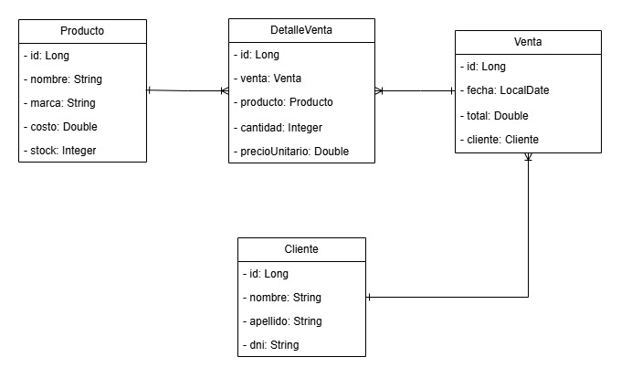

# Bazar API

API REST desarrollada con **Java y Spring Boot** para la gestión de productos, clientes y ventas de un bazar.

El proyecto fue desarrollado tomando como base el trabajo práctico integrador final del curso **"Desarrollo de APIs en Java con Spring Boot" de TodoCode Academy**, incorporando además funcionalidades adicionales como control de stock, manejo global de excepciones y operaciones transaccionales.

## Tecnologías

- Java 21
- Spring Boot
- Spring Web
- Spring Data JPA
- Hibernate
- MySQL
- Maven
- Lombok
- Postman
- Docker

## Arquitectura

El proyecto utiliza una arquitectura por capas:

```text
Controller → Service → Repository → Database
```

Se utilizan **DTOs y Mappers** para separar los objetos expuestos por la API de las entidades utilizadas para la persistencia.

```text
Request → Controller → Service → Entity → Repository → MySQL
                                      ↓
Response ← Controller ← Mapper ← Entity
```

## Funcionalidades

### Productos

- CRUD completo.
- Consulta de productos con stock inferior a 5 unidades.

### Clientes

- CRUD completo.

### Ventas

- CRUD completo.
- Consulta de los productos asociados a una venta.
- Resumen de ventas por fecha.
- Consulta de la venta de mayor monto.

### Funcionalidades adicionales — Bonus

Además de los requerimientos originales, se implementó:

- Verificación de stock antes de realizar una venta.
- Descuento automático del stock al crear una venta.
- Restauración y actualización del stock al modificar una venta.
- Restauración del stock al eliminar una venta.
- Respuesta detallada cuando uno o más productos no cuentan con stock suficiente.
- Manejo global de excepciones mediante `@RestControllerAdvice`.
- Operaciones transaccionales mediante `@Transactional`.

## API

La API utiliza la siguiente URL base:

```text
http://localhost:8080/api
```

Los endpoints fueron diseñados siguiendo convenciones de **REST**, utilizando el recurso como parte de la URL y el método HTTP para indicar la operación.

Por este motivo, en lugar de utilizar rutas como:

```text
POST /productos/crear
PUT /productos/editar/{id}
DELETE /productos/eliminar/{id}
```

se utilizan:

```text
POST /api/productos
PUT /api/productos/{id}
DELETE /api/productos/{id}
```

Esto permite mantener URLs orientadas a recursos y aprovechar la semántica de los métodos HTTP.

### Productos

| Método | Endpoint | Descripción |
|---|---|---|
| GET | `/api/productos` | Obtener todos los productos |
| GET | `/api/productos/{id}` | Obtener un producto |
| POST | `/api/productos` | Crear un producto |
| PUT | `/api/productos/{id}` | Actualizar un producto |
| DELETE | `/api/productos/{id}` | Eliminar un producto |
| GET | `/api/productos/falta_stock` | Obtener productos con stock inferior a 5 |

### Clientes

| Método | Endpoint | Descripción |
|---|---|---|
| GET | `/api/clientes` | Obtener todos los clientes |
| GET | `/api/clientes/{id}` | Obtener un cliente |
| POST | `/api/clientes` | Crear un cliente |
| PUT | `/api/clientes/{id}` | Actualizar un cliente |
| DELETE | `/api/clientes/{id}` | Eliminar un cliente |

### Ventas

| Método | Endpoint | Descripción |
|---|---|---|
| GET | `/api/ventas` | Obtener todas las ventas |
| GET | `/api/ventas/{id}` | Obtener una venta |
| POST | `/api/ventas` | Crear una venta |
| PUT | `/api/ventas/{id}` | Actualizar una venta |
| DELETE | `/api/ventas/{id}` | Eliminar una venta |
| GET | `/api/ventas/productos/{id}` | Obtener los productos de una venta |
| GET | `/api/ventas/resumen/{fecha}` | Obtener resumen de ventas por fecha |
| GET | `/api/ventas/mayor_venta` | Obtener la venta de mayor monto |

## Ejemplos

### Crear un producto

```http
POST /api/productos
Content-Type: application/json
```

```json
{
  "nombre": "Cacerola",
  "marca": "Tramontina",
  "costo": 75000,
  "stock": 7
}
```

### Crear una venta

```http
POST /api/ventas
Content-Type: application/json
```

```json
{
  "clienteId": 1,
  "detalles": [
    {
      "productoId": 1,
      "cantidad": 3
    }
  ]
}
```

El precio unitario se obtiene automáticamente a partir del precio final del producto y el total de la venta se calcula a partir de sus detalles.

### Resumen de ventas por fecha

```http
GET /api/ventas/resumen/2026-08-29
```

La fecha debe utilizar el formato `YYYY-MM-DD`.

Ejemplo de respuesta:

```json
{
  "fecha": "2026-08-29",
  "cantidadVentas": 3,
  "montoTotal": 245000.0
}
```

### Venta de mayor monto

```http
GET /api/ventas/mayor_venta
```

Devuelve el código de venta, total, cantidad de productos y datos del cliente asociado.

## Manejo de errores

La API utiliza excepciones personalizadas y un manejador global mediante `@RestControllerAdvice`.

Por ejemplo, ante un recurso inexistente:

```json
{
  "status": 404,
  "message": "Producto con ID 10 no encontrado."
}
```

Cuando una venta no cuenta con stock suficiente:

```json
{
  "status": 409,
  "message": "Stock insuficiente para uno o más productos.",
  "productos": [
    {
      "productoId": 1,
      "stockDisponible": 10,
      "cantidadSolicitada": 15
    }
  ]
}
```

## Modelo de datos

El modelo está compuesto por las entidades `Producto`, `Venta`, `DetalleVenta` y `Cliente`.

`DetalleVenta` representa la relación entre `Venta` y `Producto`, permitiendo almacenar información específica de cada producto dentro de una venta, como cantidad, precio unitario y subtotal.

### Diagrama UML



## Base de datos

El proyecto utiliza **MySQL** para la persistencia y **Spring Data JPA / Hibernate** para el mapeo objeto-relacional.

La base de datos se configura automáticamente mediante **Docker Compose**, utilizando la imagen de MySQL definida en `docker-compose.yml`.

## Ejecución

Se requiere tener instalado **Docker**, **Docker Compose** y **Maven**.

Clonar el repositorio:

```bash
git clone https://github.com/MateoSpatola/Proyecto-Final-Spring-Boot.git
cd Proyecto-Final-Spring-Boot
```

Antes de construir la imagen de la API, es necesario generar el archivo `.jar` mediante Maven:

```bash
cd api
mvn clean package -DskipTests
cd ..
```

Luego, desde la raíz del proyecto, ejecutar:

```bash
docker compose up --build
```

Docker Compose se encargará de levantar la API Spring Boot y la base de datos MySQL.

Una vez iniciados los contenedores, la API estará disponible en:

```text
http://localhost:8080
```

Para detener los contenedores:

```bash
docker compose down
```

## Postman

Se incluye una colección de Postman con los endpoints utilizados para probar la API.

[Importar colección de Postman](postman/Bazar-API.postman_collection.json)

La colección utiliza la variable `{{baseUrl}}`, configurada inicialmente como:

```text
http://localhost:8080
```

## Documentación adicional

- [Consigna original](docs/Consigna.pdf)
- [Diagrama de clases UML](docs/Diagrama_Clases_UML.jpg)
- [Colección de Postman](postman/Bazar-API.postman_collection.json)

## Autor

**Mateo Spatola**